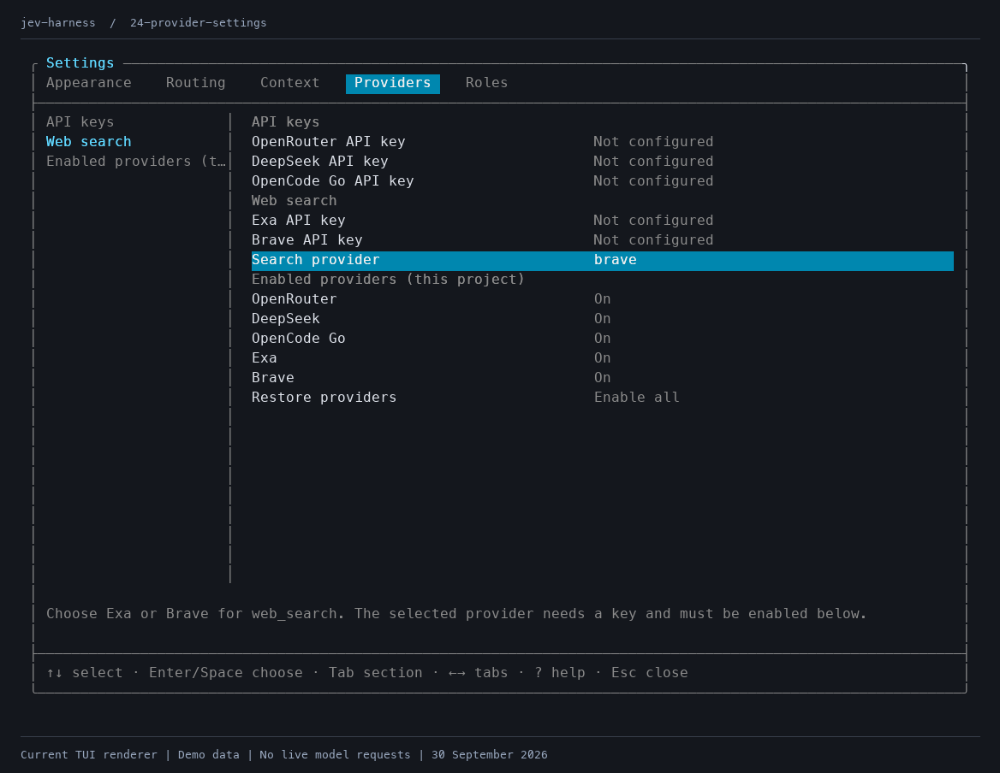
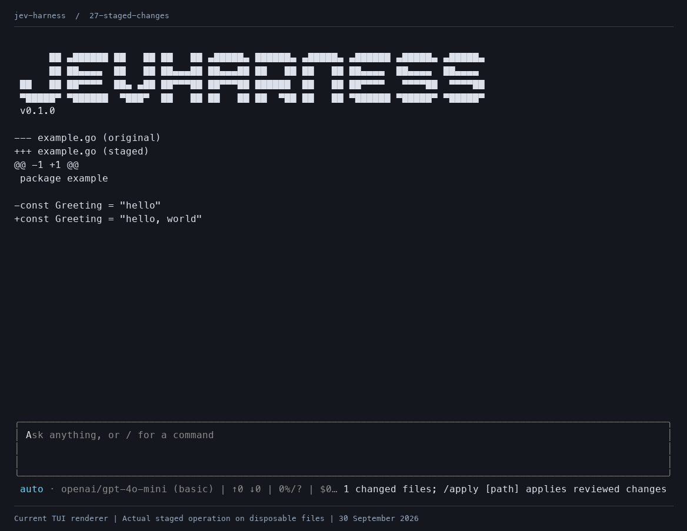

# Jev harness

A terminal coding agent that asks Jev to choose a model role for each user turn. Roles map task descriptions to models on OpenRouter, direct DeepSeek or OpenCode Go. Replies stream into the terminal, and tool continuations stay on the selected model.

**Not recommended for use.** This is an experimental project for disposable trials. Local shell commands have normal host filesystem and network access, even though they start in a staged copy. The optional Docker sandbox is experimental and off by default. Live provider compatibility and routing quality have not been established by this review.

Read the [current review](REVIEW.md) for open findings and verification results, and [SECURITY.md](SECURITY.md) for the execution boundary. Use a throwaway workspace and separate API keys with provider spending limits. Revoke trial keys after use.

## Current interface

The captures below use the current TUI renderer. Routing choices, replies and usage are demo data, with no live model requests. The staged diff and apply captures use actual operations on disposable files.

### Routing

Jev chooses among the enabled roles using the current prompt and recent conversation. Below-threshold decisions use the default role. `/role <name>` pins a role; `/role auto` restores routing. A pinned role shows `pinned`, without an invented confidence score.


### Settings and search

Settings now have Appearance, Routing, Context, Providers and Roles tabs. The Providers tab has project-specific provider toggles, masked key editors and an Exa or Brave search chooser. Disabling OpenRouter skips automatic classification and uses an enabled default role.



### Staged review

File tools edit a private copy. `/changes` shows the current diff, and `/apply` applies reviewed changes with conflict checks. Local shell commands can access host paths outside that copy, so staging does not isolate them.



The [full gallery](screenshots/README.md) includes approvals, command output, roles, session browsing, compaction, apply and recovery. All 30 images were regenerated on 30 September 2026. The captures show interface behaviour, not measured model performance.

## Build and trial

Install Go 1.26 or later. Build from this repository, then run the executable in a disposable project directory.

```sh
go build -o jev ./cmd/jev
export OPENROUTER_API_KEY='your-trial-key'
./jev doctor
./jev --mode inspect --ephemeral
```

`inspect` allows file reads, file search and configured web search. It denies model-requested file changes and shell commands. Without `--mode inspect`, new sessions default to `develop`, which asks for approval before edits and commands. `--ephemeral` avoids saved conversation files and removes its temporary staged copy on orderly exit.

Provider requests send conversation data outside your machine. Automatic classification sends the prompt and recent conversation to OpenRouter. The answering provider receives the conversation and tool results. A pinned role or a single enabled role bypasses classification.

## Commands and input

| Command | Behaviour |
| --- | --- |
| `/mode inspect` | Allow reads and search; deny model edits and shell commands |
| `/mode develop` | Ask for approval before model edits and shell commands |
| `/mode autonomous` | Allow tools without per-call approval |
| `/roles` | Show role criteria, providers and models |
| `/role <name>` | Pin a role; use `auto` to restore routing |
| `/changes [path]` | Review all staged changes or one file |
| `/apply [path]` | Apply the currently reviewed changes with conflict checks |
| `/undo <path>` | Restore an applied file if later edits would not be overwritten |
| `/discard` | Discard staged edits and refresh the copy from the project |
| `/attach <path>` | Add a staged file to the message draft |
| `/compact` | Summarise older conversation context |
| `/recover` | Acknowledge an interrupted session |
| `/settings` | Edit roles, providers and interface preferences |
| `/stats` | Show usage, models and reported cost |
| `/doctor` | Report the shell backend and check Docker when enabled |

`/yolo` toggles autonomous mode. It removes tool approvals and keeps the same shell backend. It does not add isolation. Permissions reset when starting, resuming or forking a session, or changing configuration. `/apply` still requires a current diff review. A user can explicitly apply staged changes in inspect mode.

Enter submits a message. During an answer, Enter queues steering for the next model request, and Alt+Enter queues a follow-up after the turn. Shift+Enter inserts a newline. Escape cancels the current turn. Ctrl+C, SIGINT and SIGTERM request cancellation and save before exit.

Use `@path` for an explicit attachment or `/attach` for paths with spaces. Attachments are limited to 64 KiB. `search_files` searches literal text or file globs and returns at most 100 matches. The agent reads a root `AGENTS.md` from the staged copy as repository guidance. That text cannot grant permissions. The agent does not automatically load executable project extensions, MCP configuration or package scripts.

## Configuration

Open `/settings` with Ctrl+O. Use Left/Right to switch tabs, Up/Down to select rows, and Enter or Space to edit or toggle. Tab moves between sections, or between rows on a page with one section. The help line describes the selected setting. Press `?` for shortcuts.

In Roles, `n` adds a role, `d` asks to delete it, and `D` sets the default. Role forms use Tab to move fields and Left/Right or Space to choose the provider. Enter saves and Escape cancels.

Each role has a name, model ID, provider and criteria describing when Jev should choose it. Role JSON also accepts `context_window`, `output_limit` and `disable_tools`. The bundled defaults are examples, not model recommendations. Unknown model limits appear as unavailable.

The Providers tab controls allowed services for the canonical project directory. Those choices live in user configuration. Settings prevent disabling the last provider used by your roles. Restore providers enables every supported provider for the current project and repairs older saved restrictions.

For DeepSeek-only trials, add a DeepSeek role, enable DeepSeek and disable the other chat providers. If OpenRouter is disabled, routing uses the enabled default role or the first enabled role. Disabled providers are excluded from classification and fallback.

Saved keys override environment variables. Use the masked fields in Providers or set the matching variables.

```sh
export OPENROUTER_API_KEY='...'
export DEEPSEEK_API_KEY='...'
export OPENCODE_GO_API_KEY='...'
export EXA_API_KEY='...'
export BRAVE_API_KEY='...'
```

Credentials live in a private 0600 configuration file, without encryption. Known credential values and secret-valued environment variables are redacted in the main agent flow. Redaction cannot find every secret. The review identifies CLI paths that currently omit saved Brave credentials from their known-value filter.

## Web search

`web_search` uses Exa or Brave. Select the service in Providers, enable its project toggle and supply its key. The `search_provider` configuration field accepts `exa` or `brave`; older configurations default to Exa. There is no automatic fallback between services.

Search returns titles, URLs, dates when available and snippets. It defaults to five results and allows at most ten. `include_domains` and `exclude_domains` restrict results. Brave converts bare domains to search operators and limits the complete query to 600 characters and 75 words.

Search works in inspect mode and does not need Docker. The host process sends the generated query and filters to the selected service over HTTPS. Search results are untrusted tool data. Search requests count toward the turn budget under `exa:web_search` or `brave:web_search`. Brave does not report a dollar cost per request; an enabled cost budget stops further requests once cost is unknown.

CLI `doctor` currently reports Exa even when Brave is selected. Check the selected service in Providers until that diagnostic is fixed.

## Experimental Docker sandbox

Enable Docker in Appearance with `x`, or set `safety.docker_sandbox` to `true`. A local Docker runtime and the tool image are required.

```sh
./jev sandbox build
./jev sandbox prepare
./jev doctor
```

`build` uses the bundled Dockerfile and an empty build context. `prepare` optionally preloads this project's Go modules from root `go.mod` and `go.sum`. Repeat preparation after dependency changes. These setup commands have network access. Tool commands run offline. Relative module replacements and other dependency ecosystems need a trusted custom image with dependencies installed.

When enabled, unavailable Docker engines or images cause an error rather than a host-shell fallback. Remote engines are rejected. Tool containers use an unprivileged user, a read-only root filesystem, no network, bounded tmpfs and resource limits. They do not receive host credentials or the Docker socket. Shell changes return through a validated archive into the staged copy.

The container limits are 2 GiB RAM, one CPU, 128 processes, 512 MiB workspace tmpfs and 1 GiB temporary tmpfs. Commands have a maximum ten-minute timeout. Docker and the image remain trusted dependencies.

## Command output and context

Compact command output is off by default. Enable it with `b` in Appearance or set `compact_command_output` to `true`. It works with both shell backends. Results show about 2 KiB of beginning/end output, completion status and a log ID. `read_command_output` fetches ranges of 2,000 bytes by default, up to 4,000 per call. Logs keep at most 1 MiB per command and report truncation.

Logs live outside the staged project, redact known credentials and follow the session's deletion or ephemeral lifecycle. Resume and fork preserve them.

Context compaction reserves output space and accepts only complete summaries smaller than the replaced messages. A recognised context-overflow rejection can trigger one compaction retry. Explicit transient HTTP rejections receive at most two retries. Transport errors and partial streams are preserved without automatic replay. Completed tools are not automatically replayed.

## Sessions and limits

Sessions save conversation messages, provider/model provenance, usage and the rendered transcript. Progress checkpoints and an event journal record work before and after tools. Resumed interrupted sessions block new tasks and apply until `/recover`. Review `/changes` first. The current implementation does not enforce that review before accepting `/recover`.

| Command | Behaviour |
| --- | --- |
| `/session` | Browse saved sessions for this project |
| `/session search <text>` | Filter by title or ID |
| `/name <title>` | Rename the current session |
| `/fork` | Copy the conversation and staged files into another session |
| `/session delete <id>` | Delete the session, logs, staged files and undo records |
| `/session export <new path>` | Create a private JSON export; inspect before sharing |
| `/session new` or `/clear` | Start fresh and keep the previous saved session |

Configuration and sessions live under `$XDG_CONFIG_HOME/jev-harness` or `~/.config/jev-harness`. Source snapshots and undo records may contain private code. `safety.retention_days` prunes old completed sessions and their staged state. The default `0` keeps them until manual deletion. Ephemeral mode disables saved-session browsing and export. A crash or forced termination can leave temporary files.

```sh
./jev --output-tokens 4096 --token-budget 100000 --time-budget 300
./jev --cost-budget 0.50
```

Defaults are 8,192 output tokens per request, 200,000 tokens per turn, 600 seconds per turn and 25 tool rounds. Missing usage reserves estimated input plus maximum output. Token estimates are approximate. A dollar budget stops subsequent requests when reported cost reaches the limit or becomes unavailable; it cannot cap an in-flight request. Use provider-side spending limits for a hard cap.

Snapshots allow at most 128 MiB, 10,000 files and 2 MiB per file. They omit symlinks, protected credential paths, `.git`, `node_modules`, `vendor`, `.cache`, the local `jev` binary, the configuration directory and files containing known plaintext credentials. Choose a smaller working directory if the project exceeds those limits.

Apply uses atomic replacements per file, but a multi-file apply is not one atomic transaction. Conflicts and later edits can prevent apply or undo. Avoid concurrent edits while applying.

## Verification and routing evaluation

The [review](REVIEW.md) records the checks run on 30 September 2026. The retained suite also runs in CI.

```sh
go test -race ./...
go vet ./...
go mod verify
JEV_DOCKER_TEST=1 go test -v ./internal/tools -run '^TestLiveDocker'
JEV_DOCKER_PROJECT_TEST=1 go test -v ./internal/tools -run '^TestLiveDockerProjectChecks$'
```

Provider and search tests use local mock servers. They do not establish compatibility with live authenticated endpoints. The latest local checks passed the race suite and Docker isolation, failure/timeout and compact-output tests. They did not rerun the full project suite inside Docker or authenticated provider completions.

To compare routed tasks with the configured default-role baseline, use the evaluation runner.

```sh
./jev eval eval/cases.jsonl > results.jsonl
```

This makes real, billed requests. Cases contain `id`, `prompt`, optional sequential `followups` and a `check` shell command. Each strategy gets a fresh ephemeral workspace. Checks use the configured shell backend, which is local by default. Output includes completion, check success, selected models, latency, reported usage/cost and accounting completeness.

The two included cases demonstrate the format. They are not a representative benchmark. There is no evidence here that routing improves speed, cost or task success over a fixed model.
