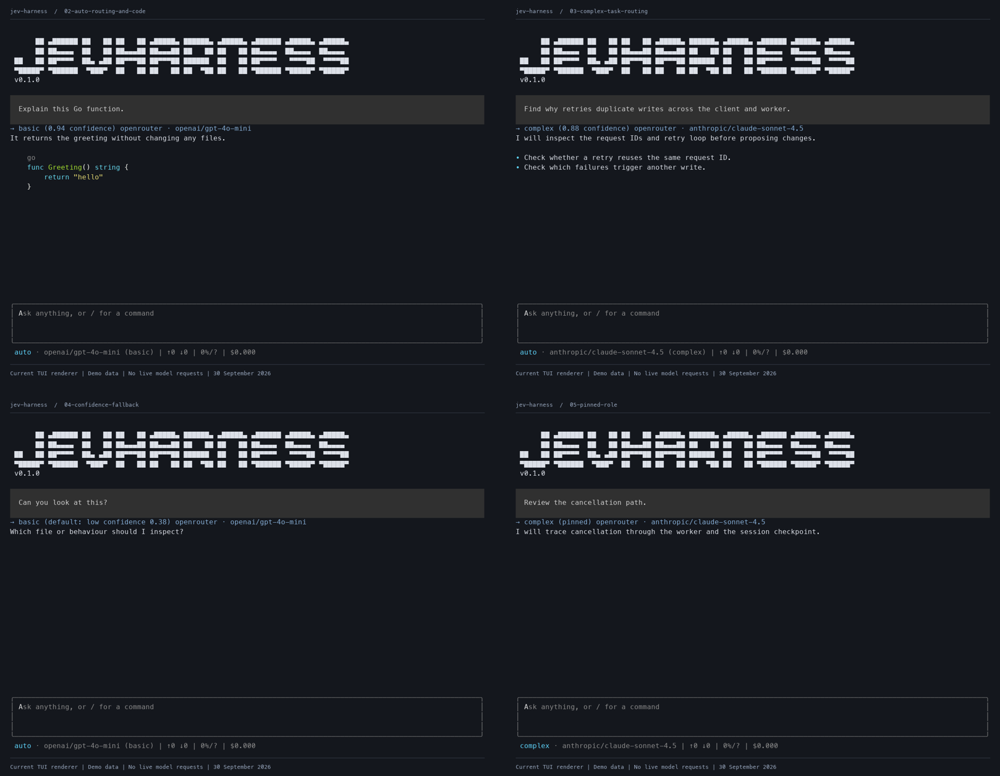
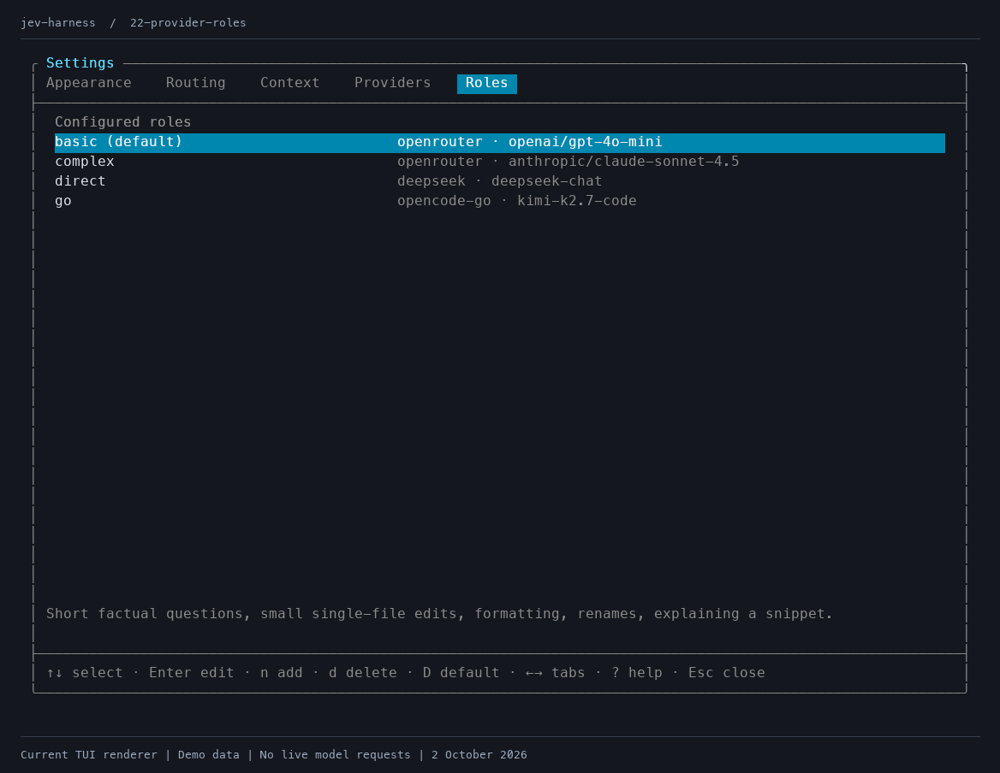

# Jev model routing showcase

A small terminal harness for trying **Jev as a model router**. You give it a task, Jev chooses a role, and the harness sends the task to the model assigned to that role. The point of this project is to see the routing decision, not to build a production coding assistant.

> **Test purposes only. Do not use this harness for real coding work.** It can read and change local files and run shell commands when you approve a tool call. `/yolo` skips those approvals. Use a throwaway workspace and separate, limited API keys. **After trying it, revoke every trial key and create new keys.**



## What the showcase demonstrates

| Task | Jev's routing result | What to notice |
| --- | --- | --- |
| A short, focused question | `basic` → `openai/gpt-4o-mini` | A lightweight model handles a small request. |
| A task spanning several packages | `complex` → `anthropic/claude-sonnet-4.5` | A more capable model handles a broader request. |
| An unclear request | Default role after low confidence | A confidence threshold gives the router a predictable fallback. |
| A manually pinned role | The selected role | You can override automatic routing for a turn. |

The main learning outcome is that **Jev can be a very fast and accurate model router** for this kind of role selection. This repository shows the decision flow and the situations it is meant to handle. It is **not a benchmark**: the screenshots below use illustrative task text, decisions, confidence values, responses, timings, and usage figures. They were rendered in the app without live OpenRouter calls. Run your own trials before drawing conclusions about speed or accuracy for your tasks.

## How routing works

1. Define roles in the settings screen. Each role has a plain English description, a provider, and a model ID. Existing roles default to OpenRouter.
2. For each new message, the harness asks Jev which role best fits the task. Recent conversation text provides context.
3. If Jev's confidence is below the chosen threshold, the harness uses the default role.
4. The selected model handles the message. The terminal shows the role, confidence, provider, model, and any tool approval requests. Every turn shows its routing result; pinned roles are labelled as pinned.

You can also pin a role with `/role <name>` or return to automatic routing with `/role auto`. Type `/` to see commands and keep typing to filter them. Use ↑/↓ to select, Tab to complete, and Esc to dismiss. Enter completes a partial command or runs a fully typed command. Outside command suggestions, Tab cycles through the available roles.

## Screenshots

The images are **illustrative captures of the interface**, not evidence of measured model performance or live API responses.

| Routing | Controls |
| --- | --- |
| [Small task → basic](screenshots/02-auto-routing-and-code.png) | [Tool approval](screenshots/06-tool-approval.png) |
| [Multi-package task → complex](screenshots/03-complex-task-routing.png) | [Roles list](screenshots/08-roles-command.png) |
| [Low-confidence fallback](screenshots/04-confidence-fallback.png) | [Routing settings](screenshots/12-routing-settings.png) |
| [Pinned role](screenshots/05-pinned-role.png) | [More screenshots](screenshots/README.md) |

### New in this showcase

Jev remains the focus: define the task criteria, send different requests, and inspect which role wins. The updated interface also lets you:

- [Map roles to different providers](screenshots/22-provider-roles.png): OpenRouter, direct DeepSeek, or OpenCode Go.
- [Find slash commands while typing](screenshots/17-command-suggestions.png).
- [Resume a saved conversation](screenshots/18-saved-sessions.png), including its context, pinned role and usage totals.
- [Inspect session stats](screenshots/19-session-stats.png), including reported routing and chat usage by model.
- [Set the compaction threshold](screenshots/20-context-settings.png) and [see when context is summarised](screenshots/21-context-compaction.png).
- [Review tools in the yellow approval panel](screenshots/06-tool-approval.png) above the input.



## Try it

You need Go 1.26 or newer and an [OpenRouter API key](https://openrouter.ai/keys). The models in the starter configuration are examples; choose models available to your account in `/settings`.

```sh
git clone https://github.com/galinauskas/jev-harness.git
cd jev-harness
export OPENROUTER_API_KEY='your-temporary-key'
go run ./cmd/jev
```

Enter a small request, then a broader one, and compare the displayed routing choices. `/roles` shows the role definitions, `/settings` lets you edit them, and `jev route "your task"` prints a routing decision without starting the terminal interface after you build the binary:

```sh
go build -o jev ./cmd/jev
./jev route "Explain this Go function"
```

The terminal can also save a key in its private configuration file. A key saved in `/settings` takes priority over `OPENROUTER_API_KEY` and applies immediately; clear the saved field to use the environment variable again. Never commit a key or paste one into screenshots. When finished, revoke each temporary key in its provider console and issue new keys if you continue using those services.

### Direct providers

Open `/settings`, press **g**, and enter the OpenRouter, DeepSeek, and/or OpenCode Go API keys. Each saved key takes priority over its matching environment variable; clear it to use the environment again. Keys are masked in the form and saved in the private config file. Alternatively:

```sh
export DEEPSEEK_API_KEY='your-deepseek-key'
export OPENCODE_GO_API_KEY='your-opencode-go-key'
```

Edit or add a role and set its **Provider** to `openrouter`, `deepseek`, or `opencode-go`. Leave it blank for OpenRouter. Use the provider's native model ID:

| Provider | Example model ID | Backend |
| --- | --- | --- |
| `openrouter` | `openai/gpt-4o-mini` | OpenRouter chat completions |
| `deepseek` | `deepseek-flash` | [DeepSeek API](https://api-docs.deepseek.com/) |
| `opencode-go` | `opencode-go/kimi-k3` | [OpenCode Go API](https://opencode.ai/v2/docs/console/go) |

Jev automatic routing still uses the OpenRouter key. A single role or a pinned role can run without that key. Provider selection is explicit: an OpenRouter `deepseek/...` model continues to use OpenRouter.

DeepSeek runs in non-thinking mode with streamed text, tool calls, and token usage. Automatic compaction uses the documented 1M-token context window for `deepseek-flash`, `deepseek-v4-pro`, and the legacy Flash aliases (conservatively treated as 1,000,000 tokens). Unknown model IDs produce a notice and skip automatic compaction. Direct DeepSeek roles also accept a `deepseek/` prefix, which is removed before API requests. Cost is only counted when reported by the provider. OpenRouter, DeepSeek, and OpenCode Go keys are removed from harness shell-tool environments.

OpenCode Go uses your subscription API key directly; no OpenCode CLI is required. Set the role provider to `opencode-go` and use a bare model ID or its full `opencode-go/` slug. For example: `opencode-go/kimi-k3`, `opencode-go/glm-5.3-flash`, `opencode-go/minimax-m2.7`, or `opencode-go/gpt-6-luna`. The harness selects Chat Completions, Anthropic Messages, or Responses according to the model, with streamed text, tool approvals, and reported token usage. Native reasoning and tool history are preserved for subsequent requests and saved-session resumes.

Go requests identify this client as `jev-harness/1.0` and send `x-opencode-session`, stable for each conversation (including compaction and session resumes). Automatic compaction uses a bundled snapshot of the [models.dev catalog](https://models.dev/) for known Go models, using the input limit where it is lower than the context limit. Unknown models skip compaction with a notice; catalog updates are needed as models change. Stats count provider-reported costs only.

Conversations are saved automatically after each completed or aborted turn and on exit. Enter `/session` to browse sessions for the current working directory, use ↑/↓ to select one, and press Enter to resume it with its conversation context, pinned role, and usage totals. Esc returns to the current chat. `/session new` (or `/clear`) starts a fresh conversation while keeping the previous one available in the list. Each launch starts a fresh chat.

Enter `/stats` (or `/session stats`) to show completed turns, input/output token totals, reported cost, models used with per-model request and usage totals, and the last prompt’s context usage. Reported routing, chat/tool-round, and compaction usage is counted, including requests before an aborted turn. Missing provider usage is excluded. The breakdown is saved with the session; older sessions retain their totals without a historical model breakdown.

Automatic context compaction summarises earlier conversation when estimated usage reaches a percentage of the selected model’s context window. Open `/settings`, press **c**, and set **1–100%** (default **80%**), or **0** to disable it. The check runs before each chat/tool request using model context metadata and token estimates calibrated by reported usage. The current user request and recent tool calls remain intact; the full visible transcript stays available, and saved sessions resume from the summary. Summarisation uses the selected model and its usage is included in session totals. If context metadata is unavailable, a notice appears and the conversation continues. A failed summary preserves the original context and stops the turn so it can be retried.

Sessions are private JSON files in `$XDG_CONFIG_HOME/jev-harness/sessions` (or `~/.config/jev-harness/sessions`). They include messages and tool output; delete these files when you want to discard saved conversations.

## Scope

This harness exists to make Jev routing easy to inspect. It includes a chat interface and local file and shell tools so you can see an end-to-end turn, but it has no operating-system sandbox. Approving a tool call allows it to act on your machine. Avoid real projects and sensitive files, and keep `/yolo` off during trials.

The code review and verification notes are in [REVIEW.md](REVIEW.md). Race-enabled regression checks and CLI/TUI smoke checks were run during the review. As in the previous review, test files were removed after verification; `go test ./...` now checks package compilation.
