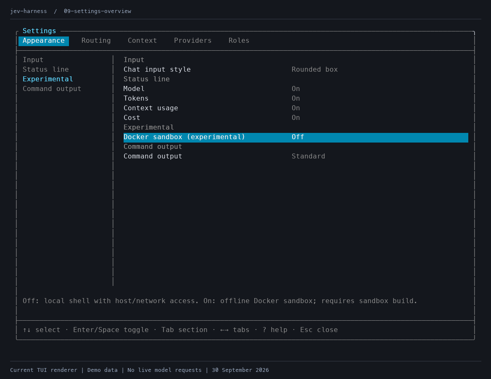
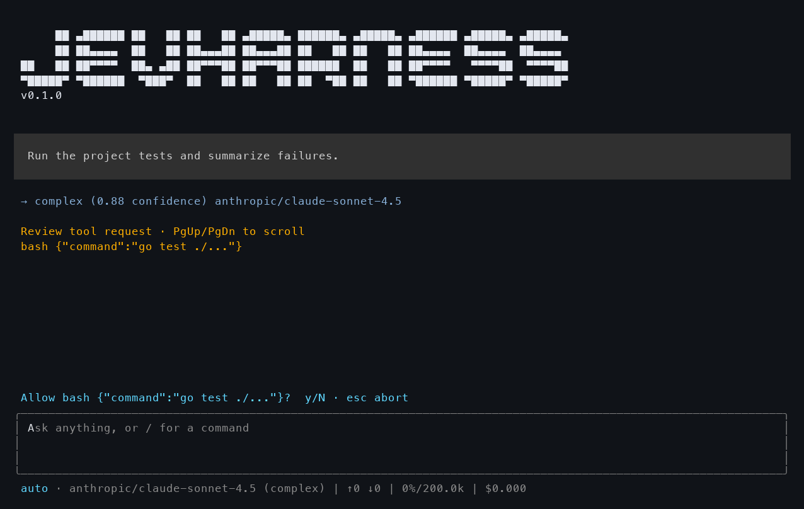
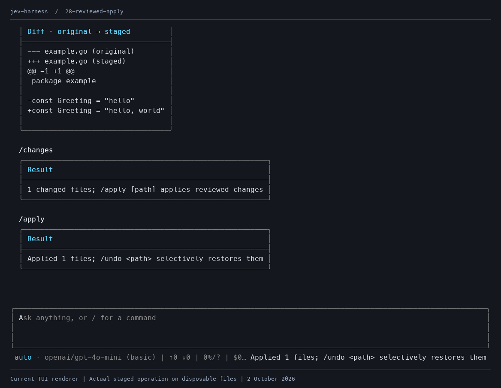
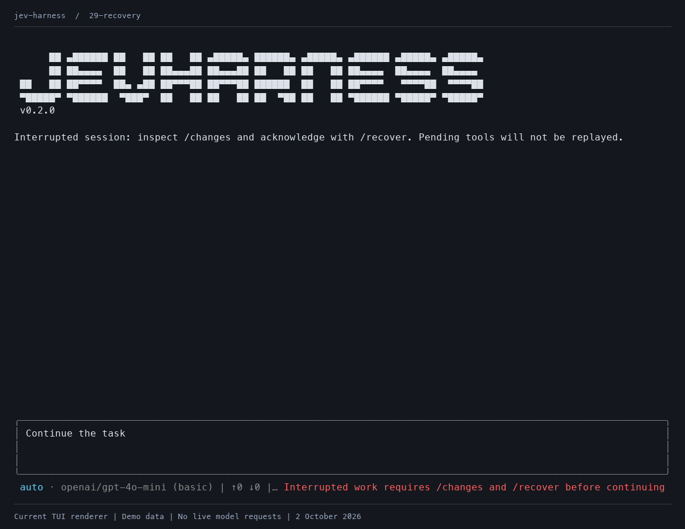

# Interface gallery

**Not recommended for use.** These captures document an experimental terminal agent. Local shell commands have host filesystem and network access. The optional Docker sandbox is experimental and off by default.

All 30 PNGs were regenerated on 30 September 2026; provider settings and slash-command captures were refreshed on 2 October 2026. Captures use the TUI renderer. They are rendered interface fixtures, not recordings of live model sessions. Task text, routing choices, confidence, answers, command output and usage are demo data. No model or search provider requests were made. The diff and apply captures execute actual staged operations on disposable files.

## Current workflow

The Appearance tab shows the shell-backend setting and compact-output option.



The Providers tab includes Exa and Brave, a default search provider for all projects.


Slash-command output uses tables for results, confirmations and errors. Role and statistics tables adapt to narrow terminals, session rows retain keyboard selection, and diffs wrap without dropping review content.

Local commands wait for approval in develop mode. Approval permits execution with normal host access.



`/changes` shows a staged diff. `/apply` applies the currently reviewed diff and records undo data.




An interrupted session blocks ordinary task submission until recovery acknowledgement. Inspect staged changes before `/recover`.



## All captures

| Capture | What it shows |
| --- | --- |
| [Routing overview](routing-overview.png) | Automatic, complex, fallback and pinned routing views |
| [Welcome](01-welcome.png) | Empty chat and the current input/status layout |
| [Basic routing](02-auto-routing-and-code.png) | A demo explanation with highlighted Go code |
| [Complex routing](03-complex-task-routing.png) | A demo debugging request assigned to the complex role |
| [Confidence fallback](04-confidence-fallback.png) | Below-threshold routing to the default role |
| [Pinned role](05-pinned-role.png) | Explicit role selection labelled pinned |
| [Tool approval](06-tool-approval.png) | Yellow approval panel for a local shell request |
| [Tool output](07-tool-output.png) | Demo command result and staged-change notice |
| [Roles](08-roles-command.png) | Role criteria, providers, model mappings and selection in a table |
| [Appearance settings](09-settings-overview.png) | Docker off by default and standard command output |
| [Edit a role](10-edit-role-criteria.png) | Criteria, model and provider fields |
| [Add a role](11-add-role.png) | A draft research role with DeepSeek selected |
| [Routing settings](12-routing-settings.png) | Routing model, confidence threshold and default role |
| [Status line settings](13-status-line-settings.png) | Visible model, token, context and cost controls |
| [Settings shortcuts](14-settings-shortcuts.png) | Current keyboard help |
| [Multiline input](15-multiline-input.png) | A message draft with horizontal input rules |
| [Autonomous mode](16-yolo-mode.png) | Automatic tool approval with a visible mode badge |
| [Command suggestions](17-command-suggestions.png) | Slash-command filtering and completion |
| [Saved sessions](18-saved-sessions.png) | A selectable table of saved conversations |
| [Session stats](19-session-stats.png) | Demo reported usage and unavailable Brave cost |
| [Context settings](20-context-settings.png) | Compaction threshold |
| [Context compaction](21-context-compaction.png) | A demo summary notice |
| [Provider roles](22-provider-roles.png) | Roles mapped to OpenRouter, direct DeepSeek and OpenCode Go |
| [Direct provider](23-direct-provider.png) | A pinned direct DeepSeek role |
| [Provider settings](24-provider-settings.png) | API keys and the default web_search provider, with Brave selected |
| [Search provider chooser](25-search-provider.png) | Exa and Brave choices |
| [Compact command output](26-compact-command-output.png) | Compact output enabled in Appearance |
| [Staged changes](27-staged-changes.png) | File summary and full diff tables from a disposable edit |
| [Reviewed apply](28-reviewed-apply.png) | Table confirming the actual apply result for that reviewed diff |
| [Recovery](29-recovery.png) | Blocked task submission after interruption |

## Regenerate

The opt-in fixture in `internal/tui/showcase_test.go` creates isolated state and renders the same views as the application. It skips during ordinary test runs. It neither loads user configuration nor calls providers. `render.py` converts the ANSI views to PNG with Pillow and adds the disclosure beneath each image.

Run from the repository root with Go, Python, Pillow and a monospace font installed.

```sh
JEV_SHOWCASE_DIR="$PWD/screenshots/.raw" go test ./internal/tui -run '^TestShowcase$' -count=1
python3 screenshots/render.py --font /path/to/monospace.ttf
```

On macOS, the renderer defaults to `/System/Library/Fonts/Menlo.ttc`. The fixture checks 112-column and 34-row bounds. The renderer decodes every generated PNG and builds the routing overview from the four routing captures. Raw ANSI output is ignored by Git.

To refresh only provider settings and the search picker, pass `--capture 24-provider-settings --capture 25-search-provider --date "2 October 2026"` to the renderer.
